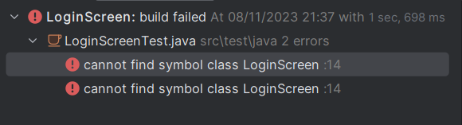

# TELA DE LOGIN (APLICAÇÃO DE TDD)
NESTA ATIVIDADE CRIAREMOS UM PROJETO JAVA PARA AUTENTICAÇÃO DE USUÁRIO E SENHA, UTILIZAREMOS O PROCESSO DE TDD DEVEMOS SEGUIR OS CINCO PASSOS:

## PASSO A PASSO
1. Escrever o teste unitário (JUnit) para a tela de login;
2. Execute o teste unitário;
3. Implementar a classe LoginScreen;
4. Execute o teste unitário novamente;
5. Documentação, exportar o JAVADOC;

# TESTES
Os testes foram formulados seguindo a metodologia TDD, onde foi feito conforme a necessidade da criação de determinadas 
classes e métodos.

1. O primeiro teste foi formulado com a criação da classe `LoginScreenTest.java`, a qual tem como objetivo realizar todos 
testes para qualificar o código, conforme abaixo:
```
public class LoginScreenTest {

}
```
2. O segundo passo foi criar métodos que realizam validações do login e senha, segue abaixo:
````
    @Test
    @DisplayName("Verifica se o usuário existe")
    public void verificaUsuarioExiste() {
        LoginScreen loginScreen = new LoginScreen();
        Assertions.assertTrue(loginScreen.login("flima","123")); // Realiza teste
    }
````
A propriedade @Test é marcação da biblioteca JUnit 5 que foi incluída no projeto, todavia, neste momento 
o a classe instanciada `LoginScreen` não havia sido criada ainda, portanto, o teste apresentou o seguinte resultado



3. Neste momento foi criada a classe `LoginScreen` com os devidos métodos usados na parte de teste, como por exemplo, o `login()` e o 
teste foi executado novamente resultado em êxito, conforme abaixo:

4. Foi realizado o teste para saber o comportamento do sistema quando as informações são passadas de forma correta.

5. Foi realizado o teste para saber o comportamento do sistema quando as informações são passadas de forma errada.


# DOCUMENTAÇÃO 
Pode ser encontrada com maior detalhe na pasta `Doc/`
